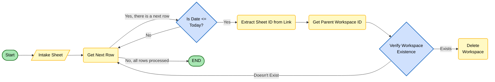

# Smartsheet Workspace Deletion

Automation project for verifying and processing Smartsheet workspace deletion using OAuth authentication and intake-sheet metadata.

## Overview

The current implementation is verification-first:

- Reads intake sheet rows.
- Resolves linked sheet and parent workspace context.
- Determines whether each row should continue to deletion processing.
- Runs deletion operations in `safe_mode=True` from the app entrypoint, so destructive actions are not executed by default.
- Logs results and exports row-level entries for auditing.

Project modules live under `app/`.

## Current Entrypoints

- Primary runtime entrypoint: `app/app.py` (`main()`)

For implementation-level API documentation, see `app/README.md`.

## High-Level Flow

### Application Initialization

1. Validate OAuth configuration.
2. Authenticate with Smartsheet via OAuth token lifecycle.
3. Initialize repository and service layers.
4. Load intake sheet and sheet catalog.
5. Filter rows eligible for evaluation.

### Per-Row Processing Decision Logic
Note: 
- This is an abstracted view of the workflow. Please review the code for a comprehensive understanding. 
- You can copy-paste the block below into Miro > Diagram > Flowchart to generate a visual 




### Finalization

6. Export logs and row-level JSON entries.

## Prerequisites

- Python 3.10+
- OAuth app credentials for Smartsheet
- Access to the intake sheet and relevant workspace/sheet resources

## Installation

```bash
pip install -r requirements.txt
```

## Configuration

Configuration is managed in `app/config.py` using the `configuration` singleton, which loads values from environment variables and defines mode flags.

### Mode Flags

- `PRODUCTION` (bool, default: `False`)
  - When `True`: uses production Smartsheet sheet/credential resources
  - When `False`: uses sandbox Smartsheet sheet/credential resources
- `LINUX_SERVER` (bool, default: `False`)
  - When `True`: token storage/retrieval uses AWS Secrets Manager
  - When `False`: token storage/retrieval uses local file

### Required Credentials (Production Mode)

When `PRODUCTION=True`:
- `APP_CLIENT_ID` — Smartsheet OAuth client ID
- `APP_SECRET` — Smartsheet OAuth client secret
- `INTAKE_SHEET_ID` — Production intake sheet ID (env var)

### Required Credentials (Sandbox Mode)

When `PRODUCTION=False`:
- `S_APP_CLIENT_ID` — Smartsheet sandbox OAuth client ID
- `S_APP_SECRET` — Smartsheet sandbox OAuth client secret
- Sandbox intake sheet ID is hardcoded in `config.py` as `S_INTAKE_SHEET_ID`

### Optional Configuration

- `REDIRECT_URI` (default: `http://localhost:8080/callback`)
- `TOKEN_FILE` (default: `smartsheet_token.json`)
- `TIMEZONE` (default: `America/Los_Angeles`)
- `FILE_LOGGING_LEVEL` (default: `DEBUG`)
- `CONSOLE_LOGGING_LEVEL` (default: `INFO`)

## Run

From repository root:

```bash
python3 app/app.py
```

## Logging and Output

- Session logs are written under `logs/`.
- Row-level audit entries are exported as line-delimited JSON (`*_entries.json`).

## Safety Notes

- Deleting Smartsheet assets is irreversible.
- Current app flow uses safe mode for delete operations by default.
- Confirm behavior in `app/app.py` before enabling destructive runs.

## AWS Lambda Notes

- OAuth/token support for AWS is implemented in `app/oauth_handler.py`.
- The runtime Lambda handler in `app/app.py` is currently commented out.
- To use Lambda from `app/app.py`, re-enable `lambda_handler` and ensure it returns a serializable summary payload.

### Token Storage in Lambda

- **Development/Testing:** Use local file storage
- **Production:** Use AWS Secrets Manager

### Required AWS Secrets

| Secret Name | Content |
|-------------|---------|
| `ausw2p-smgr-smt-access-token-001` | Access token (plain string) |
| `ausw2p-smgr-smt-refresh-token-002` | Refresh token (plain string) |
| `ausw2p-smgr-smt-client-id-003` | JSON: `{"CLIENT_ID": "..."}` |
| `ausw2p-smgr-smt-client-secret-004` | JSON: `{"CLIENT_SECRET": "..."}` |

### Required IAM Permissions

```json
{
  "Version": "2012-10-17",
  "Statement": [
    {
      "Effect": "Allow",
      "Action": [
        "secretsmanager:GetSecretValue",
        "secretsmanager:PutSecretValue",
        "secretsmanager:CreateSecret"
      ],
      "Resource": [
        "arn:aws:secretsmanager:*:*:secret:ausw2p-smgr-smt-*"
      ]
    }
  ]
}
```
