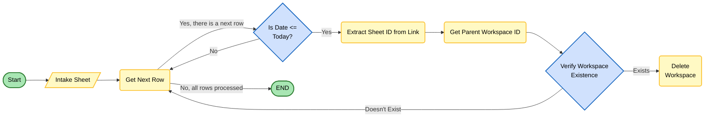

# Smartsheet Workspace Deletion - Application Documentation

## Table of Contents
- [Overview](#overview)
- [Current Execution Mode](#current-execution-mode)
- [Architecture](#architecture)
- [Module Reference](#module-reference)
- [Data Flow](#data-flow)
- [Configuration](#configuration)
- [Token Storage](#token-storage)
- [Error Handling](#error-handling)

## Overview

This project automates Smartsheet workspace cleanup based on intake-sheet dates and links.

The current application entrypoint in `app.py` uses a verification-first workflow and imports helper functions from `workspace_verification.py`.

## Current Execution Mode

As implemented today:

- `app.py::main()` runs a verification workflow.
- It evaluates intake rows, resolves workspace IDs, and determines expected actions.
- It calls `delete_verified_workspaces(..., safe_mode=True)`, which means destructive API delete actions are not executed.
- It writes session logs and line-delimited JSON entry exports under `logs/`.

Important behavior notes in the current implementation:

- `main()` does not return a summary dictionary.
- Validation/authentication failures are logged, but `main()` does not currently fail fast at those checkpoints.
- The Lambda handler block in `app.py` is currently commented out.

## Architecture

The application currently follows this flow:

```
┌──────────────────────────────────────────────┐
│              app.py (Entry Point)           │
│   - main()                                  │
│   - Imports verification helpers             │
└──────────────────────┬───────────────────────┘
                       │
┌──────────────────────▼───────────────────────┐
│      workspace_verification.py (Helpers)     │
│   - verify_project_status()                  │
│   - delete_verified_workspaces()             │
└──────────────────────┬───────────────────────┘
                       │
┌──────────────────────▼───────────────────────┐
│       service.py (Business Logic)            │
│   - WorkspaceDeletionService                 │
└──────────────────────┬───────────────────────┘
                       │
┌──────────────────────▼───────────────────────┐
│    repository.py (Smartsheet API Access)     │
│   - SmartsheetRepository                     │
└──────────────────────┬───────────────────────┘
                       │
┌──────────────────────▼───────────────────────┐
│        oauth_handler.py (Auth Layer)         │
│   - OAuth + token lifecycle                  │
└──────────────────────────────────────────────┘
```

Supporting modules:

- `config.py`: Environment-backed settings and validation
- `utils.py`: Date helpers, filtering, row-log utilities

## Module Reference

### app.py

**Purpose:** Runtime entrypoint for the verification-first workflow.

**`main()`**

Current process:

1. Configure logging and file logging output.
2. Validate OAuth configuration.
3. Authenticate with Smartsheet client.
4. Build `SmartsheetRepository` and `WorkspaceDeletionService` instances.
5. Determine intake sheet ID based on `configuration.PRODUCTION` flag.
6. Load intake sheet and list all sheets.
7. Get current date in configured timezone.
8. Filter rows using `filter_intake_data(..., has_folder_url=True)`.
9. Verify rows using `verify_project_status(...)`.
10. Run deletion phase with `delete_verified_workspaces(..., safe_mode=True)`.
11. Log summary and export row entries JSON.

Return behavior: Returns `None` (no explicit return statement).

### config.py

**Purpose:** Centralized configuration and validation from environment variables.

**Key class:** `Config` (instantiated as singleton `configuration`)

**Mode flags:**
- `PRODUCTION` (bool): When `True`, use production resources; when `False`, use sandbox
- `LINUX_SERVER` (bool): When `True`, use AWS Secrets Manager for tokens; when `False`, use local file

**Key attributes:**
- `CLIENT_ID`, `CLIENT_SECRET`: Resolved based on `PRODUCTION` flag
- `INTAKE_SHEET_ID`, `S_INTAKE_SHEET_ID`: Sheet IDs for prod and sandbox
- `COLUMN_TITLES`: Column ID mapping, selected based on `PRODUCTION` flag
- `OAUTH_SCOPES`: Required OAuth scopes for Smartsheet API

**Key methods:**
- `validate_oauth_config()`: Verify required OAuth credentials are set

---

### workspace_verification.py

**Purpose:** Reusable verification and deletion-orchestration helper functions.

**Key functions:**
- `verify_project_status(smartsheet_rows_list, todays_date, service, all_sheets)`: Process rows and return `RowLogEntry` list
- `delete_verified_workspaces(log_entries, repository, service, safe_mode=True)`: Execute deletion workflow
- `main()`: Standalone entrypoint that returns summary dict (not used by `app.py`)

### oauth_handler.py

**Purpose:** OAuth 2.0 flow, token persistence, refresh, and client creation.

**Primary entrypoint:** `get_smartsheet_client(scopes)`

**Token storage routing:**
- If `configuration.LINUX_SERVER=True`: Use AWS Secrets Manager (requires boto3)
- If `configuration.LINUX_SERVER=False`: Use local file (`configuration.TOKEN_FILE`)

**Key functions:**
- `build_auth_url(scopes, state)`: Construct OAuth authorization URL
- `exchange_code_for_tokens(code)`: Exchange auth code for access/refresh tokens
- `refresh_tokens(refresh_token)`: Refresh expired access token
- `load_tokens()`: Load stored tokens from appropriate storage
- `save_tokens(access_token, refresh_token)`: Save tokens to appropriate storage
- `validate_client(client)`: Validate access token with `get_current_user()` call

### repository.py

**Purpose:** Encapsulates Smartsheet SDK/API operations.

**Primary class:** `SmartsheetRepository`

**Key methods:**
- `get_sheet(sheet_id)`: Retrieve sheet data
- `list_all_sheets()`: List all accessible sheets
- `get_workspace(workspace_id)`: Get workspace metadata
- `get_all_workspace_children(workspace_id)`: List sheets/folders/sights in workspace
- `delete_workspace(workspace_id, safe_mode=True)`: Delete workspace
- `delete_sheet(sheet_id, safe_mode=True)`: Delete sheet
- `delete_folder(folder_id, safe_mode=True)`: Delete folder
- `delete_sight(sight_id, safe_mode=True)`: Delete sight
- `update_cell(sheet_id, row_id, column_id, new_value, safe_mode=True)`: Update cell value

### service.py

**Purpose:** Business logic for workspace resolution, validation, and deletion orchestration.

**Primary class:** `WorkspaceDeletionService`

**Key methods:**
- `extract_row_data(row)`: Extract required fields from intake row
- `process_row_for_checks(smartsheet_row, extracted_row_data, all_sheets)`: Validate row and check prerequisites
- `process_workspace_id_resolution(smartsheet_row, extracted_row_data, all_sheets)`: Resolve workspace ID from sheet permalink
- `process_workspace_existence(smartsheet_row, workspace_id)`: Verify workspace exists
- `get_all_workspace_content(workspace_id)`: Traverse and collect workspace sheets/folders/sights
- `delete_all_workspace_content(all_workspace_content, safe_mode=True)`: Delete collected items
- `process_deletion_status_update(entry, safe_mode=True)`: Update intake sheet deletion status

### utils.py

**Purpose:** Utility and helper functions for date handling, filtering, and structured row logging.

**Key functions:**
- `get_pacific_today_date()`: Get today's date in configured timezone
- `filter_intake_data(intake_sheet_data, todays_date, has_folder_url)`: Filter rows by deletion date and folder URL presence
- `get_expected_action(deletion_date, em_notification_date, todays_date)`: Compute DELETE_WORKSPACE / KEEP_WORKSPACE / MISSING_DELETION_DATE
- `setup_file_logging(session_name, log_dir, file_level)`: Create session log file under `logs/`

**Key classes:**
- `RowLogEntry`: Dataclass for structured row-level logging (exported as JSONL)

## Data Flow

### Current Runtime Flow (`app.py::main`)

```
1. Start app.py main
2. Configure logging + file logger
3. Validate OAuth config
4. Authenticate client
5. Create repository/service
6. Load intake sheet + list all sheets
7. Resolve Pacific date
8. Filter intake rows
9. verify_project_status(...)
10. delete_verified_workspaces(..., safe_mode=True)
11. Write summary logs
12. Export row entries JSON (logs/*_entries.json)
```

### Decision Logic (Per Row)

For each row, the workflow:

1. **Extract:** Pull folder URL, deletion date, EM notification date from cells
2. **Validate:** Check required fields present, URL format valid, row not already marked deleted
3. **Resolve:** Extract sheet ID from URL, match against `list_all_sheets()` output
4. **Verify:** Confirm workspace still exists via API
5. **Compute expected action:**
   - `DELETE_WORKSPACE`: if deletion date is today or past AND today is not EM notification date
   - `KEEP_WORKSPACE`: if deletion date is in future
   - `MISSING_DELETION_DATE`: if deletion date cell is empty
6. **Process:** If marked for deletion and all checks pass, delete workspace content then workspace
7. **Update:** Mark row's deletion status as "Deleted" (or "SAFE MODE: Deleted" if `safe_mode=True`)



---

## Configuration

See root `README.md` for configuration details. Key points:

- Mode is controlled by `PRODUCTION` flag (default: `False` = sandbox)
- Credentials and sheet IDs are selected based on mode
- Column ID mapping is mode-dependent

---

## Token Storage

Token storage is routed based on `LINUX_SERVER` flag:

- `LINUX_SERVER=False` (default): Local file (`TOKEN_FILE`)
- `LINUX_SERVER=True`: AWS Secrets Manager (see AWS section in root `README.md`)

---

## Error Handling

**Exception types:**
- `ConfigurationError` in `config.py` — missing required configuration
- `SmartsheetAPIError` in `repository.py` — API call failure
- `WorkspaceDeletionError` in `service.py` — deletion workflow failure

**Error strategy:**
- Row-level errors are logged and processing continues for other rows
- Configuration/authentication errors are logged in `app.py` but execution may continue
- `workspace_verification.py::main()` returns structured error payloads
- `app.py::main()` currently logs errors without returning structured payload
